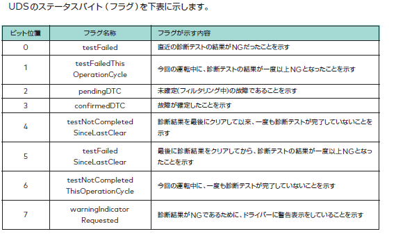

## Search VIN
- echo "22 F1 90" | isotpsend -s 7E0 -d 7E8 vcan0

## Startup Message
- echo "11 01" | isotpsend -s 7E0 -d 7E8 vcan0
- https://piembsystech.com/data-identifiers-did-of-uds-protocol-iso-14229/

DID

## Engine Troubule?
- echo "19 02 FF" | isotpsend -s 7E0 -d 7E8 vcan0 で
    - 19: DTC読み取り
    - 02: 
      - 参照：https://piembsystech.com/read-dtc-information-service-0x19-uds-protocol/
      - masting bit
        - 
      
